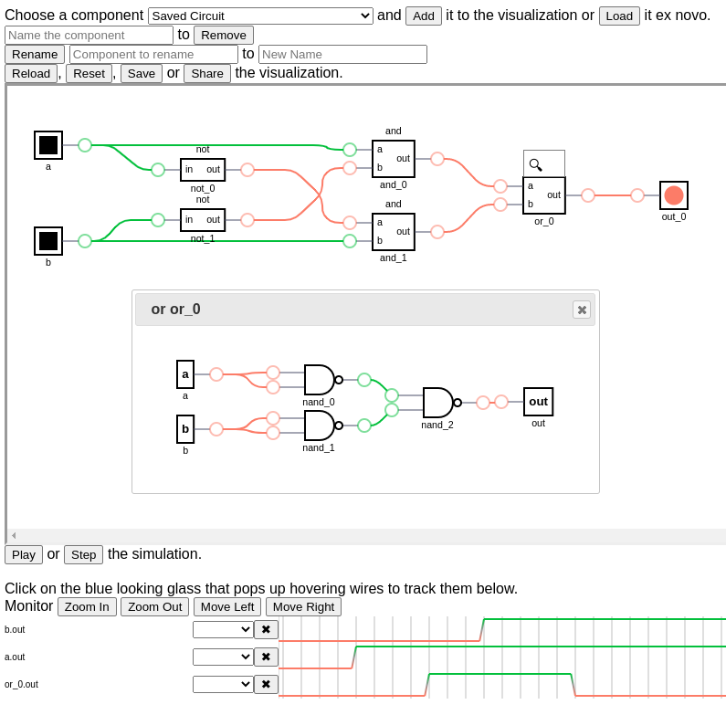

# S.H.E.A.S. - Simple Hardware Editor and Simulator

A prototype of a simple purely graphical hardware editor and simulator for educational purposes, based on [DigitalJS](https://github.com/tilk/digitaljs) computer architecture visualization and simulation library.

### Live Web Page Available [Here](https://sheas.magiwanders.com)



### Documentation
To have an idea of how S.H.E.A.S. works, see the [getting started tutorial](docs/getting_started.md).

To embed S.H.E.A.S. in a webpage, the suggested way is to import this repo as a submodule and import every ```.js``` file in your code **except ```index.js```**.

Then, use a placeholder div in your HTML:

```html
<div id="sheas_container"></div>
```

Optionally, you can put anything inside the placeholder as it will be cleared before containing S.H.E.A.S., for example your favourite loader:

```html
<div id="sheas_container">
  <div style="width:100%; height:100%">
    <div class="loader"></div>
  </div>
</div>
```

For embedding only the visualization and the simulation controls (the ones below it) use:

```javascript
buildSHEAS('embedded', document.getElementById('sheas_container'), <chip>)
```

The embedded version can be used more than once per page.

Where ```<chip>``` is a ```string``` of the compressed chip you want to load (the one copied into the clipboard by the "Share only the chip" button).

For embedding the whole of S.H.E.A.S. use:

```javascript
buildSHEAS('complete', document.getElementById('sheas_container'))
```

The whole of S.H.E.A.S. can be embedded only once in a page.
